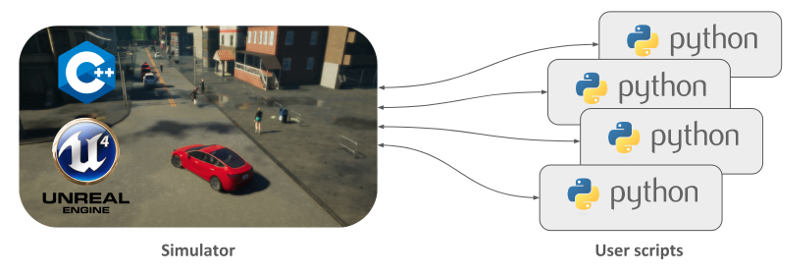
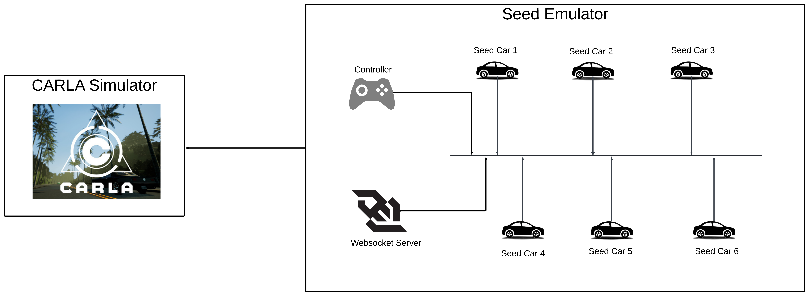
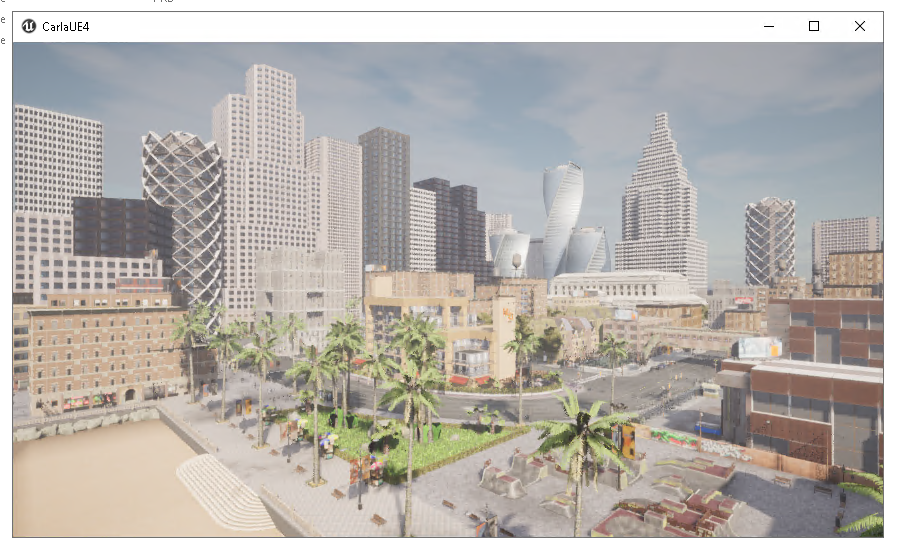

# CARLA-SEED Example
This manual provides comprehensive guidance on setting up, operating, and optimizing Carla-Seed, ensuring you efficiently leverage both simulation and emulation.
## Table of Contents
- [CARLA-SEED](#carla-seed)
  - [Table of Contents](#table-of-contents)
  - [What is CARLA Simulator](#what-is-carla-simulator)
## What is CARLA Simulator
CARLA Simulator is an open-source platform designed specifically for the development and testing of autonomous driving systems. It uses Unreal Engine, known for its powerful rendering capabilities, to create highly realistic urban environments. This allows researchers and developers to simulate and analyze various scenarios that autonomous vehicles might encounter.
Read More: https://carla.readthedocs.io/en/latest/start_introduction/
## Key Components of CARLA Simulator
The architecture of CARLA is based on a client-server model.

### CARLA Server/World
In the CARLA Simulator setup, the server handles all the core tasks necessary for the simulation. This includes rendering the sensors, computing the physics to ensure realistic interactions within the simulated world, and updating the state of the world and its various actors. Given the demand for high-quality, realistic outputs, the server ideally runs on a dedicated GPU. This setup is particularly important as it helps in efficiently managing intensive tasks, thereby enhancing the fidelity and responsiveness of the simulation.
### CARLA Client
CARLA clients represent the entities interacting with the simulation environment. These clients can be autonomous vehicles, Python programs, or any other entities controlling the logic of actors within the scene and setting world conditions. Leveraging the CARLA API, available in Python or C++, these clients communicate with the server to influence the simulation.
Read More: https://carla.readthedocs.io/en/latest/foundations/#world-and-client
## CARLA Simulator + SEED Emulator 
### Integration Architecture


### System Requirements 
### CARLA Simulator Installation
#### System Requirements for CARLA Server
- **Operating Systems:** Windows, Linux
- **CPU:** Quad-core Intel or AMD, 2.5 GHz or faster
- **RAM (Memory):** 
	- Minimum: 16 GB 
	- Recommended: 32 GB for optimal performance
- **GPU:**
    - Minimum: 6 GB RAM
    - Recommended: 8 GB RAM for optimal performance
    - Note: Dedicated GPU strongly recommended for machine learning
- **Disk Space:** 20 GB free space
- **Python:** Version 3.7 supported on both Windows and Linux
- **Pip:** Version 20.3 or higher
- **Network:** TCP ports 2000, 2001 and 2002 must be open
#### Windows Installation
1. **Visit the CARLA GitHub Page:**
    - Access the CARLA GitHub repository to find the latest releases and information. [CARLA GitHub Page](https://github.com/carla-simulator/carla/blob/master/Docs/download.md).
2. **Download the Windows Version:**
    - Look for the latest CARLA package for Windows and proceed to download it.
3. **Unzip the Downloaded Package**
    - After downloading, extract the contents of the CARLA package.
4. **Install  important pip3 packages:**
    - Open Command Prompt as an administrator.
    - Run the command to install Pygame and NumPy.
	```python 
		pip3 install --user pygame numpy	
	```
    - Additionally, install CARLA python package run this command.
    ```python
	    pip3 install carla
	```
5. **Navigate to CARLA Root Directory:**
    - Use the Command Prompt to move to the directory where CARLA was extracted.
        ```cmd
	    cd path\to\carla\root		
        ```
6. **Launch CARLA:**
    - Run the command `CarlaUE4.exe` to start CARLA.
#### Linux Installation
1. **Visit the CARLA GitHub Page:**
    - Access the CARLA GitHub repository to find the latest releases and information. [CARLA GitHub Page](https://github.com/carla-simulator/carla/blob/master/Docs/download.md).
2. **Download the Linux Version:**
    - Look for the latest CARLA package for Linux and proceed to download it. 
3. **Download and Unzip:**
    - Utilize `tar` to extract the contents of the CARLA package.
    ```bash
	    tar -xvzf CARLA_PACKAGE_NAME.tar.gz
	```
4. **Install important pip3 packages:**
    - In Terminal, install Pygame and NumPy, and then the CARLA Python package.
    ```bash
	    pip3 install --user pygame numpy 
	    pip3 install carla
	```
5. **Navigate to CARLA Root Directory:**
    - Change directory to where you extracted CARLA.
	```shell
	    cd path/to/carla/root
	```
6. **Launch CARLA:**
    - Run the command `./CarlaUE4.sh` to start CARLA.


Upon launching CARLA, a window showcasing a cityscape in spectator mode appears; navigate using the mouse and WASD keys, with the right mouse button for directional control, as the server awaits client connections for interactive simulation.
### SEED Emulator Installation
#### Install the necessary software
To run the emulator, you need to install `docker`, `docker-compose`, and `python3`
#### Set up the environment variable
To run the emulator code, you need to add this folder to the `PYTHONPATH` environment variable. This can be done by running `source development.env` inside the project's root directory.
#### Run SEED Emulator
Build and run the generated containers. First `cd output/`, then do `docker-compose build && docker-compose up`. The emulator will start running.
### Usage 


### Integration Features

#### Simulation Controls

#### Data Exchange

#### Visualizations

### Troubleshooting

#### Common Issues

A list of common problems that may arise when using the integration and their solutions.
#### Debugging Tips 

Tips for diagnosing and fixing issues specific to the integration

### Future Work 

