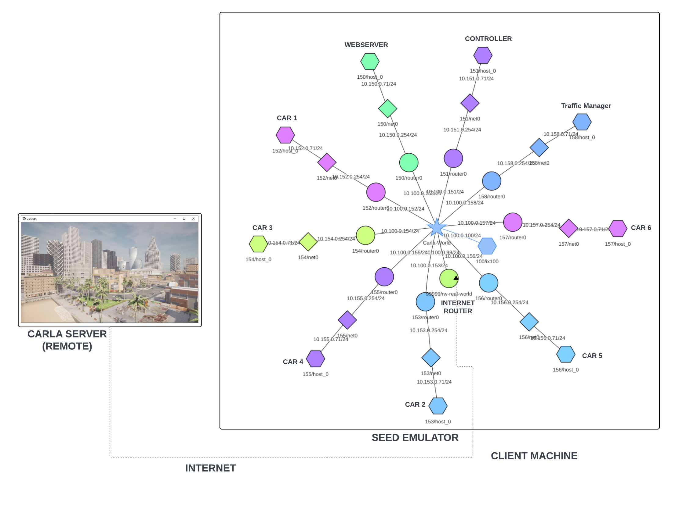

# CARLA-SEED 

The Developer Manual offers detailed insights into project architecture, technical implementation, visualization, and future developments, as well as troubleshooting guidance. 
## Table of Contents
- [CARLA-SEED](#carla-seed)
  - [Table of Contents](#table-of-contents)
  - [Core Concepts](#core-concepts)
  - [Project Architecture](#project-architecture)
	  - [Base components of Architecture](#base-components-of-architecture)
      - [Initilization Work Flow](#initialization-flow)
	  -  [Setting a destination Workflow](#setting-a-destination-workflow)
  - [Technical Implementation](#technical-implementation)
	  - [Controller.py](#controllerpy)
	
## Core concepts
### World and client

The 'world' is the central element of the server that holds the simulation's state, and clients connect to it using the IP address (default: localhost) and port (default: 2000) to interact or modify the simulation.

Read More: https://carla.readthedocs.io/en/latest/core_concepts/#1st-world-and-client
### Traffic Manager

The Traffic Manager in CARLA Simulator acts as a built-in system that governs vehicles not involved in learning, orchestrating realistic behaviors to emulate urban environments accurately.

Read More: https://carla.readthedocs.io/en/latest/ts_traffic_simulation_overview/#traffic-manager
### Synchronous and asynchronous mode

In this mode, the client and server operate in lockstep, with the server waiting for the client to process each simulation step before proceeding to the next. This ensures determinism and precise control over the simulation but can lead to slower overall execution.

Read More : https://carla.readthedocs.io/en/latest/foundations/#synchronous-and-asynchronous-mode

### Sensors

In CARLA, sensors are vital for vehicles to gather information about their surroundings. These specialized actors, attached to vehicles, capture data such as camera images, radar readings, and lidar scans, aiding in simulation and analysis tasks.

Read More: https://carla.readthedocs.io/en/latest/core_concepts/#4th-sensors-and-data
## Project Architecture




### Base components of Architecture

**Car Containers (Host-152 to Host-157):**
Each car container runs an instance of `automatic.control.py`, with six distinct containers handling separate cars in the simulation. They're designed for minimal CPU usage and are identified as Host-152 through Host-157 in the architecture

**Web Socket Container (Host-150):**
This container acts as a dedicated communication hub, enabling real-time interactions between the Controller and the Car containers. It uses WebSocket protocol to facilitate bidirectional messaging.

**Controller (Host-151)**
The Controller orchestrates the simulation by setting car locations, fetching data, and issuing commands to the Car containers. It's the administrative center of the simulation, interacting with the cars through the WebSocket container.

**Internet Router (99999/real-world):**
This router represents the gateway for all the containers to connect with the wider internet, allowing data to flow between the CARLA server and the SEED emulator, effectively bridging the simulation with the client machine.

**Traffic Manager(Host -158):**
The Traffic Manager generates both vehicle and pedestrian traffic, creating a comprehensive and lively urban simulation environment.

**CARLA Server:**
 Running remotely, the CARLA server is the simulation engine powered by Unreal Engine, creating high-fidelity visual and physical simulations of driving environments. It connects to the SEED emulator via the internet.
 
 **Client Machine:**
Located elsewhere, this machine serves as the user's point of access to the simulation.

**SEED Emulator Internet Map:**
The SEED Emulator acts like a virtual traffic system, simulating the network that connects all the cars in the simulation. It makes sure that messages and data travel between the cars and the controllers just like they would over real-world internet connections. It's a key part of the setup that lets the cars "talk" to each other and to the main control center.

**CarlaViz Container**:
Although not depicted in the diagram, the CarlaViz container is an integral part of the Docker network. It offers a live visual feed of the simulation, enabling users to graphically track and analyze the movements and interactions of the vehicles within the CARLA Server environment. Its connectivity to the same network ensures seamless integration with the simulation data flow.

### Initialization Flow:


This flowchart details the process for a car container to establish a connection to the CARLA simulation world and to the WebSocket container. Initially, the car container sends two separate connection requests: one to the CARLA world and another to the WebSocket container. Both requests are relayed through the Internet Exchange, with the CARLA world request proceeding to the Internet Router and then to the CARLA Server, while the WebSocket request goes directly to the WebSocket Container. If the CARLA Server is running, it accepts the connection and sends a confirmation back to the car container via the Internet Router, establishing a continuous sensory data feed. Conversely, if the WebSocket Container is not running, the connection request is refused. Otherwise, the connection is accepted. Once the car container is successfully connected, it processes the data from the CARLA Server, makes decisions based on that data, and then sends the decisions back to the CARLA Server. Meanwhile, it connects to the webserver, listens on a port, and waits for any instructions from the Controller, completing the initialization process and being ready for interactive simulation.

### Setting a destination Workflow:


The diagram outlines the workflow for setting a destination in a vehicle simulation system. The process begins with the Controller Container, which sends a destination to the WebSocket Container. This request is routed through the Internet Exchange to the WebSocket Container, which checks if the destination is meant for one car or all cars. If it’s for one car, the WebSocket sends the information to that specific car. If it’s for all cars, the WebSocket broadcasts the destination to every car container. Once the correct car or cars receive the request, they set the new destination. As a car reaches the destination, it sends a notification back through the WebSocket Container. Finally, the Controller receives a notification that confirms the car's arrival at the specified location. This workflow ensures that destination commands are accurately communicated and acknowledged within the system.
### Technical Implementation:
#### Controller.py
##### **Command Line Argument Details**

***WebSocket and CARLA Server Configurations****: The script allows configuration of IP addresses and port numbers for both the WebSocket and CARLA servers to establish connections. This is crucial for environments where the servers may not run on default settings or local hosts.
```python
parser.add_argument("--w_ip", default="localhost", help="IP address of the WebSocket server") `
parser.add_argument("--w_port", default="6789", help="Port number of the WebSocket server") `
parser.add_argument("--c_ip", default="localhost", help="IP address of the CARLA server") `
parser.add_argument("--c_port", default=2000, type=int, help="Port number of the CARLA server")`
```


##### Arguments information
###### WebSocket IP (--w_ip)**
- **Default**: `localhost`
- **Purpose**: Specifies the IP address of the WebSocket server.
- **Usage Example**:
	```cmd
	 --w_ip 192.168.1.1 
	 ```
###### **WebSocket Port (--w_port)**
- **Default**: `6789`
- **Purpose**: Specifies the port number on which the WebSocket server is listening.
- **Usage Example**: 
    ```cmd
    -- w_port 6789
    ```
###### **CARLA Server IP (--c_ip)**
- **Default**: `"localhost"`
- **Purpose**: Specifies the IP address of the CARLA server.
- **Usage Example**:
    ```cmd
	--c_ip 192.168.1.2
	```
###### **CARLA Server Port (--c_port)**
- **Default**: `2000`
- **Purpose**: Specifies the port number on which the CARLA server is listening.
- **Usage Example**:  
    ```cmd
	--c_port 2000
	```
##### **Location (--location)**
- **Default**: `"Townhall"`
- **Purpose**: Specifies a predefined location name to set as the destination for the vehicle(s).
- **Predefined Options**: `"Townhall"`, `"Museum"`, `"Hotel"`, `"Basketballcourt"`, `"Skateboardpark"`
- **Usage Example**:
    ```cmd
	--location Museum
	```
##### **Vehicle Identifier (--id)**
- **Default**: `"all"`
- **Purpose**: Specifies the identifier for the vehicle to which the location will be sent or `"all"` to send to all vehicles.
- **Usage Example**:
    ```cmd
	--id carlaseed1
	```
##### **List Cars (--list)**
- **Purpose**: When this flag is used, the script will list all vehicle role names and exit.
- **Usage Example**:
    ```cmd
	--list
	```
##### **Car Info (--c_info)**
- **Purpose**: Retrieves detailed information for a specific car based on its role name.
- **Usage Example**:
    ```cmd
	--c_info role123
	```
#### **Destination Management**

- **Setting and Broadcasting Destinations**: The script provides functionality to set a destination for a specific vehicle or all vehicles, which is crucial for tests involving navigation and route planning. The destination is sent via WebSocket, ensuring that it reaches all relevant clients connected to the server.

`async def set_destination(location_name, id="all")`

###### **Define Destination Data**:
    destination = {"type": "set_destination", "location_name": location_name, "car_id": id}
    
**Purpose**: Constructs a JSON object containing the type of request, the destination location, and the car ID, preparing it for transmission.

**Establish WebSocket Connection**:
    `async with websockets.connect(WEBSOCKET_URI) as websocket:`
    
**Purpose**: Opens a WebSocket connection using the previously constructed URI, enabling real-time data transfer.

 **Send Destination Data**:
    `await websocket.send(json.dumps(destination))`
    
**Purpose**: Sends the JSON-encoded destination data over the WebSocket connection to the server, which then communicates it to the designated vehicle(s).


#### **Notification Handling**

- **Listening for Status Updates**: This function listens for notifications such as 'destination reached', allowing the script to handle real-time updates about vehicle states which are essential for monitoring the progress of navigation tasks.

`async def receive_notifications():`
**Receiving Messages:**
    
    pythonCopy code
    
    `message = await websocket.recv()`
    
    **Purpose**: Suspends the function to wait for and receive a message from the WebSocket server.


pythonCopy code

`if data['type'] == 'destination_reached':`

**Purpose**: Checks if the received message indicates that a vehicle has reached its designated destination, triggering specific actions based on this event.

1. **Parsing JSON Message:**
    
    pythonCopy code
    
    `data = json.loads(message)`
    
    **Purpose**: Converts the received JSON string into a Python dictionary for easy data manipulation.
#### **Asynchronous Execution and Signal Handling**

- **Handling User Interruptions**: The script is equipped to handle unexpected terminations gracefully, ensuring that all operations are concluded properly without leaving processes hanging, which is vital for maintaining the integrity of the simulation environment.

pythonCopy code

`if __name__ == "__main__":`

#### **Predefined Locations and Navigation**

- **Utilization of Predefined Locations**: Maps predefined location names to their coordinates within the CARLA environment, facilitating easy setting of destinations for vehicles. This feature supports simulations that require vehicles to navigate to specific points.

pythonCopy code

`locations = {"Townhall": (112.705, 9.616, 0.605), ...}`

#### **Error Handling and Validations**

- **Robust Error Checks**: The script includes checks for valid location names and handles connection errors robustly, ensuring that any misconfiguration or server issues are reported clearly to the user.

pythonCopy code

`if args.location and args.location in locations:     ... else:     print("Invalid location name provided or no location name provided. Exiting.")`
#### **Construct WebSocket URI**

- **Purpose**: Build the URI needed to connect to the WebSocket using command-line-provided IP and port.
- **Code Snippet**:
    `WEBSOCKET_URI = f"ws://{args.w_ip}:{args.w_port}"`


#### **Get Vehicle Roles Function**
- **Purpose**: Fetch and display the roles and IDs of all vehicles present in the simulation, useful for targeting commands.
- **Code Snippet**:
    `def get_vehicle_roles():`

#### **Get Vehicle Info Function**

- **Purpose**: Obtain and print detailed data about a specific vehicle based on its role name, including real-time location and movement parameters.
- **Code Snippet**:
    
    pythonCopy code
    
	    `async def get_vehicle_info(role_name):`

### Integration Architecture

### System Requirements 

### CARLA Simulator Installation

### SEED Emulator Installation

one

### Usage 
### Integration Features

#### Simulation Controls

#### Data Exchange

#### Visualizations

### Troubleshooting

#### Common Issues

A list of common problems that may arise when using the integration and their solutions.
#### Debugging Tips 

Tips for diagnosing and fixing issues specific to the integration

